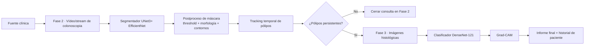
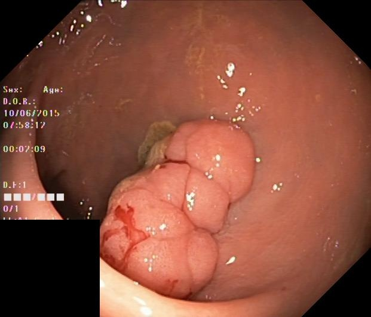
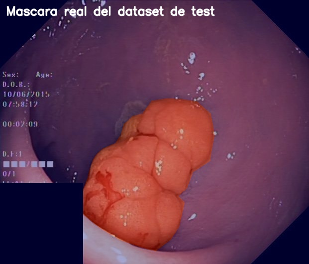
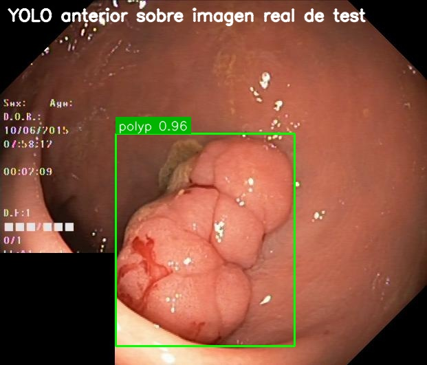
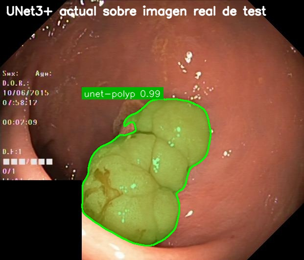
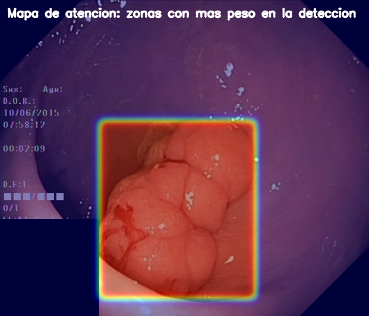
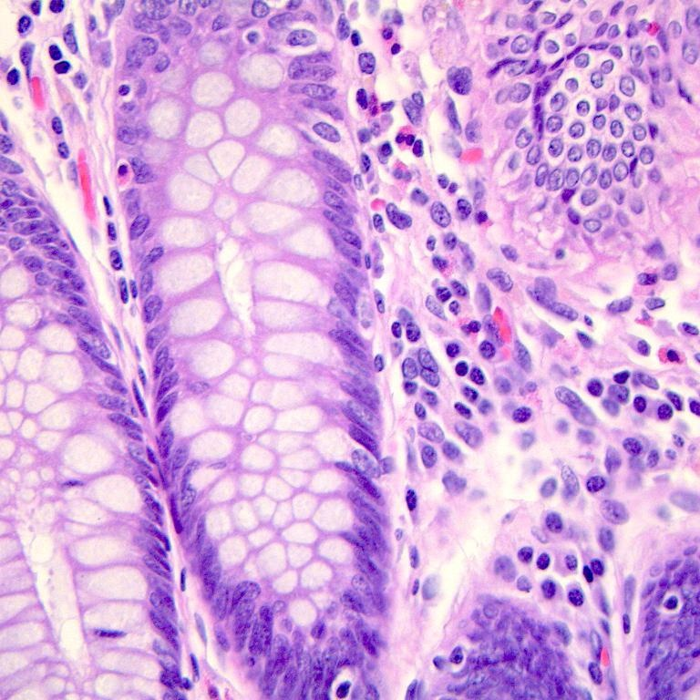
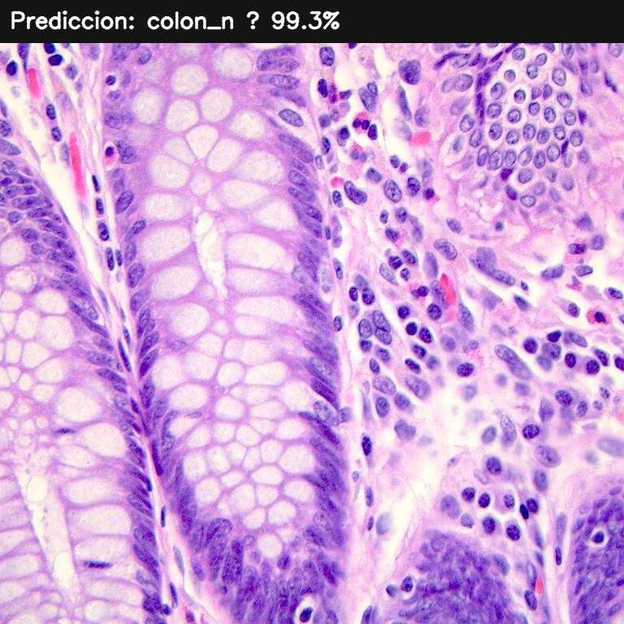
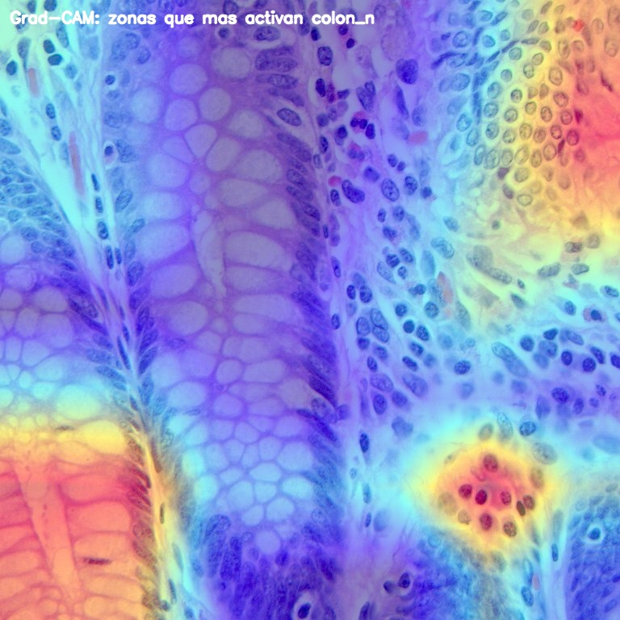

# Documentación Técnica Narrada de IA de Imagen Médica

## Alcance de este documento

Este documento describe de forma completa la parte de inteligencia artificial basada en imagen del proyecto **AiColonDiagnosis**, centrada únicamente en:

- **Fase 2: Colonoscopia**
- **Fase 3: Foto histológica**

La **Fase 1** queda fuera de alcance porque fue desarrollada por otro equipo. Aun así, cuando el flujo global de la aplicación condiciona a las Fases 2 y 3, se explica esa relación para que el comportamiento del sistema tenga sentido de extremo a extremo.

La intención de esta memoria no es solo listar archivos, métricas o nombres de modelos. También busca dejar constancia del proceso real de construcción: qué queríamos conseguir, qué decisiones tomamos, qué salió mal, qué tuvimos que corregir y por qué la solución final terminó siendo distinta de la idea inicial.

---

## 1. Business Understanding y definición del escenario médico

### 1.1 Resumen ejecutivo del simulador

AiColonDiagnosis nace como un simulador de apoyo a la decisión clínica en el contexto del cáncer de colon. La idea general del proyecto es dividir la consulta en varias fases, pero en esta parte de la memoria nos centramos solo en aquellas donde la evidencia principal proviene de imágenes médicas.

Desde el principio nos propusimos resolver dos preguntas distintas pero relacionadas. La primera era si, durante una **colonoscopia**, el sistema podía señalar regiones compatibles con pólipos de forma útil y estable. La segunda era si, una vez obtenida una **imagen histológica**, podíamos apoyar la interpretación con un clasificador visual que distinguiera tejido tumoral de tejido no tumoral y, además, mostrara qué zonas influían en la decisión.

La visión inicial era relativamente simple: detectar en Fase 2 y clasificar en Fase 3. Sin embargo, en cuanto empezamos a conectar los modelos a una interfaz real y a revisar resultados como lo haría un usuario, vimos que eso no bastaba. No era suficiente con “detectar algo” ni con “dar un porcentaje”. El sistema tenía que ser capaz de:

- comportarse de forma razonable cuando el vídeo fuera inestable,
- no contar varias veces el mismo pólipo,
- enseñar visualmente por qué marcaba una región,
- y guardar evidencias reutilizables para poder revisar la consulta más tarde.

Ese cambio de perspectiva hizo que el proyecto dejara de ser un ejercicio aislado de entrenamiento de modelos y se convirtiera en una construcción más completa: **modelo + postproceso + lógica temporal + explicabilidad + UX clínica**.

### 1.2 Definición del escenario clínico

El escenario clínico que se simula es el de una detección temprana o una verificación asistida de hallazgos compatibles con cáncer colorrectal. Dentro de ese escenario, las fases de imagen tienen funciones distintas.

La **Fase 2** trabaja sobre vídeo o stream de colonoscopia. Su función no es diagnosticar por sí sola, sino detectar regiones sospechosas que puedan corresponder a pólipos y resumir la exploración con métricas útiles: cuántos frames se revisaron, cuántos contenían candidatos, cuántos pólipos distintos se confirmaron y cuál fue la confianza estimada del modelo.

La **Fase 3** trabaja sobre una o varias imágenes histológicas. Aquí el problema ya no es localizar una lesión en un vídeo cambiante, sino clasificar tejido en una imagen estática y aportar una explicación visual tipo **Grad-CAM** que ayude a interpretar la decisión.

Había una restricción clínica lógica que nos pareció importante mantener desde el principio: si en colonoscopia no se confirman pólipos persistentes, no tiene sentido forzar una fase histológica como si existiera una muestra que analizar. Por eso la app actual **termina la consulta en Fase 2 cuando no hay hallazgos persistentes**. Esa decisión mejora la coherencia del flujo y evita enseñar un camino artificial que en práctica clínica no tendría sentido.

### 1.3 Objetivos del proyecto

#### Objetivos de negocio

En términos de negocio y de producto, queríamos que esta parte del simulador ayudara a responder a una necesidad concreta: **priorizar la revisión y documentar mejor la evidencia visual**. No se planteó como una herramienta autónoma de diagnóstico, sino como un asistente que pudiera:

- ayudar a revisar exploraciones largas,
- señalar de forma consistente regiones sospechosas,
- guardar evidencias por paciente,
- y facilitar una explicación posterior del resultado.

Otro objetivo importante era que la experiencia resultara convincente para un perfil clínico. Eso implica más que “una app que funciona”: implica un flujo razonable, botones entendibles, pantallas centradas, imágenes guardadas en historial y una salida final que no sea un texto plano sin contexto.

#### Objetivos técnicos

Técnicamente, los objetivos fueron evolucionando. Al inicio el objetivo parecía ser simplemente detectar pólipos en vídeo y clasificar imágenes histológicas. Más adelante entendimos que había varios subobjetivos más concretos:

- lograr una detección robusta de pólipos en vídeo real, no solo en ejemplos limpios,
- reducir falsos positivos provocados por reflejos, ángulos o geometrías ambiguas,
- mejorar la representación visual pasando de cajas aproximadas a máscaras más fieles,
- añadir memoria temporal para no sobrecontar pólipos,
- soportar múltiples imágenes histológicas en una misma consulta,
- y proporcionar explicaciones visuales para ambas fases.

La conclusión fue clara: la parte difícil no estaba solo en entrenar un modelo con buenas métricas, sino en conseguir que el sistema completo se comportara con criterio cuando se usa de verdad.

---

## 2. Especificación de requisitos y casos de uso

### 2.1 Requisitos funcionales y no funcionales

#### Requisitos funcionales

La Fase 2 debía permitir cargar tanto un **vídeo** como una **webcam**, procesar frames en tiempo real y producir un resultado que fuera algo más que una cuenta de detecciones. Por eso el requisito real no fue simplemente “detectar pólipos”, sino “detectar, filtrar temporalmente y decidir cuántos pólipos únicos han aparecido”.

Además, queríamos que el resultado no se perdiera una vez cerrada la fase. De ahí nacen dos requisitos que acabaron siendo muy importantes:

- guardar el mejor frame o la mejor evidencia visual,
- y permitir volver a verla desde el historial del paciente.

En Fase 3, el requisito principal era poder cargar **una o varias imágenes** histológicas. Esto no fue un detalle menor. En una versión muy temprana la fase estaba concebida como una única imagen, pero pronto vimos que eso limitaba demasiado el uso. Una consulta real puede incluir varias muestras o varias vistas de una misma muestra, así que la app tenía que aceptar más de una imagen y resumir el conjunto.

También se consideró requisito funcional que el sistema mostrara **en qué se ha fijado el modelo**, tanto al terminar la prueba como al recuperar una consulta del historial. Este punto dejó de tratarse como un extra opcional y pasó a ser parte del flujo central.

#### Requisitos no funcionales

Los requisitos no funcionales condicionaron muchas decisiones importantes. El primero fue el rendimiento: todo debía poder ejecutarse en un entorno de trabajo razonable, sin depender de una infraestructura pesada. Eso afectó tanto a la elección de modelos como a los tamaños de imagen, al uso de AMP y a la forma de presentar el resultado en la interfaz.

Otro requisito no funcional fue la **trazabilidad**. No bastaba con que la app “se viera bien”; teníamos que poder justificar por qué se eligió un modelo y no otro. Por eso se conservan scripts de entrenamiento, carpetas de resultados, curvas, CSVs, comparativas y checkpoints.

Un tercer requisito no funcional fue la **estabilidad clínica percibida**. Aunque no sea una métrica estándar, fue muy importante durante el desarrollo. Si la app contaba varios pólipos donde el vídeo mostraba realmente uno, o si una imagen histológica se presentaba sin una explicación visual razonable, la experiencia perdía credibilidad aunque el modelo tuviera buenas cifras en offline.

### 2.2 Casos de uso y escenarios de usuario

#### Caso de uso A: revisión de colonoscopia

El usuario carga un vídeo de colonoscopia o conecta una webcam. En cada frame, el sistema analiza la imagen y genera regiones sospechosas. Sin embargo, esas regiones no se convierten automáticamente en “pólipos confirmados”. El sistema necesita persistencia temporal. Ese requisito se añadió después de observar que en vídeo real aparecían activaciones breves debidas a movimiento, desenfoque o reflejos.

Por tanto, el caso de uso completo quedó así:

1. Se inicia la exploración.
2. El modelo segmenta regiones candidatas.
3. La app asocia regiones entre frames para mantener una identidad temporal.
4. Solo si la región se mantiene el tiempo mínimo exigido, se confirma un pólipo.
5. Si la lesión desaparece poco tiempo y vuelve, se considera la misma.
6. Si no hay persistencia suficiente, la fase termina sin habilitar histología.

Este escenario fue decisivo para entender que el problema no era exclusivamente de visión por computador, sino también de diseño de reglas sobre el tiempo.

#### Caso de uso B: análisis histológico

En Fase 3 el profesional selecciona una o varias imágenes. El sistema analiza cada una por separado, estima la clase más probable y calcula un mapa Grad-CAM para la clase predicha. Después genera un resumen conjunto.

Lo importante aquí era que la fase pudiera soportar distintos patrones de uso:

- una única imagen para un caso simple,
- varias imágenes para una revisión más completa,
- y revisión posterior desde el historial sin necesidad de repetir la inferencia.

#### Caso de uso C: revisión de historial por paciente

Este caso de uso apareció con fuerza a medida que la aplicación fue madurando. Al principio pensábamos más en el flujo de la consulta en vivo, pero pronto se hizo evidente que una herramienta útil debía permitir volver atrás y revisar:

- qué imagen se usó,
- qué vio el modelo,
- cómo se mostró el resultado,
- y qué se guardó finalmente para ese paciente.

Por eso el historial acabó guardándose **por paciente y por consulta**, no por pruebas aisladas. Desde ahí se puede abrir la evidencia de Fase 2 y la de Fase 3 por separado.

---

## 3. Arquitectura del sistema y especificaciones técnicas

### 3.1 Diagramas de arquitectura del sistema

Este diagrama resume bastante bien cómo terminó siendo el sistema. Es importante remarcar que el modelo no decide solo. En colonoscopia, el bloque de **postproceso de máscara** y el bloque de **tracking temporal** son tan importantes como la red. De hecho, una parte significativa de los errores que vimos al principio se resolvieron fuera del modelo, en esa capa de lógica intermedia.

### 3.2 Justificación del stack tecnológico

Elegimos **Python** como lenguaje principal por una razón práctica clara: nos permitía unificar entrenamiento, inferencia, preprocesado y prototipado de interfaz sin cambiar de ecosistema. Esto redujo fricción y aceleró el ciclo de prueba-error.

La app principal se terminó concentrando en **PySide6**, porque nos daba una interfaz de escritorio más estable y controlable que las primeras ventanas auxiliares. Una parte importante del trabajo final tuvo que ver precisamente con eso: que las ventanas se abrieran donde debían, que no bloquearan la vista y que el resultado se pudiera navegar como una aplicación coherente.

Para visión por computador utilizamos **PyTorch** como base común y **OpenCV** como herramienta práctica de vídeo, overlays, contornos y postproceso. En la fase exploratoria de modelos, **Ultralytics YOLO** permitió construir rápido una primera línea base. Más tarde, la parte de segmentación médica aprovechó **Hugging Face**, `safetensors` y `timm` para cargar y ajustar un modelo ya especializado en pólipos.

La justificación final del stack no fue ideológica. Fue pragmática. Elegimos lo que permitía entrenar, comparar, integrar en la app y corregir problemas sin cambiar constantemente de herramientas.

### 3.3 Flujo de datos

#### Flujo de Fase 2

El flujo de Fase 2 comienza con la captura del frame. Ese frame se redimensiona al tamaño que necesita el segmentador actual y se convierte en tensor. El modelo genera una probabilidad por píxel. A partir de ahí entra la parte que fue ganando importancia a lo largo del proyecto: umbralado, filtrado por área mínima, apertura/cierre morfológico, extracción de contornos y conversión a regiones manejables.

Después viene una fase de asociación temporal. Las detecciones de cada frame se comparan con tracks anteriores usando geometría y lógica de reaparición. Aquí se decide si algo es un candidato nuevo, si es el mismo pólipo de antes o si no hay persistencia suficiente para confirmarlo.

Por último, el sistema guarda la mejor evidencia visual para poder recuperarla en el informe y en el historial.

#### Flujo de Fase 3

El flujo de Fase 3 es más clásico: carga de imagen, transformaciones, normalización y clasificación. Sin embargo, no se dejó como un pipeline cerrado de entrada-salida. Después de la predicción se calcula un Grad-CAM para la clase seleccionada y se generan tres artefactos persistentes:

- imagen original,
- imagen de resultado,
- imagen de enfoque del modelo.

Eso hace que Fase 3 no sea solo un clasificador, sino un bloque de inferencia acompañado de explicabilidad y persistencia documental.

---

## 4. Data Understanding y Data Preparation

### 4.1 Origen de datos

#### Fase 2: Colonoscopia

La primera base de trabajo en colonoscopia fue el dataset local ya preparado en `data/dataset_yolo/`. Ese dataset nos permitió entrenar el baseline inicial y, lo que es más importante, levantar la aplicación y empezar a probar comportamiento real en vídeo.

Cuando vimos que el modelo inicial no era suficientemente sólido, la reacción natural fue buscar más datos. La referencia más evidente fue **Kvasir-SEG**, un dataset conocido en segmentación de pólipos. Se montó entonces una nueva ruta de preparación en `data/dataset_polyp_segmenter/` y una carpeta para fuentes externas en `data/external_polyp_sources/`.

Sin embargo, al construir el pipeline de deduplicación descubrimos que gran parte del material externo era redundante con respecto al dataset local. El resultado fue:

- muestras locales vistas: **2000**
- muestras externas inspeccionadas: **1000**
- añadidas realmente: **0**
- duplicadas descartadas: **849**
- duplicadas respecto a test descartadas: **151**
- dataset final limpio: **1972**
- split final: **train 1377 / val 296 / test 299**

Esta parte fue importante porque nos enseñó una lección que en proyectos de este tipo aparece mucho: añadir datos sin control puede dar una falsa sensación de mejora. Aquí la decisión correcta no fue “meter todo”, sino conservar un conjunto limpio y evitar fuga de información.

#### Fase 3: Histología

En histología la situación fue más favorable desde el punto de vista de datos. El dataset está organizado en `data/dataset_colon/` y ya venía estructurado por carpetas compatibles con `ImageFolder`, con las dos clases:

- `colon_aca`: adenocarcinoma
- `colon_n`: tejido normal

La distribución documentada por el script de entrenamiento es:

- `train`: `3500 colon_aca + 3500 colon_n`
- `val`: `750 + 750`
- `test`: `750 + 750`

Esta estructura permitió plantear una competición de modelos bastante limpia. En este caso, el mayor reto no fue la calidad del dato, sino elegir bien la arquitectura que mejor aprovechara el transfer learning.

### 4.2 Limpieza y estructuración de datos tabulares

Aunque esta memoria no documenta la Fase 1, sí merece la pena explicar una idea metodológica que también se aplicó aquí: cada fase debía tener una estructura de datos que permitiera reproducibilidad y comparación honesta.

En colonoscopia esto se tradujo en un manifiesto deduplicado, con control de splits y verificación de máscaras. En histología se tradujo en una estructura de carpetas estable y fácilmente reutilizable en diferentes arquitecturas de clasificación.

No hicimos una “limpieza” superficial solo para que el dataset cargara. Lo que se buscó fue garantizar que:

- el entrenamiento y la validación estuvieran separados,
- el test no se contaminara,
- y las comparativas entre modelos se hicieran sobre una base consistente.

### 4.3 Procesamiento de imágenes médicas

#### Colonoscopia

El modelo final de colonoscopia trabaja con:

- tamaño de imagen: **352 px**
- umbral de máscara: **0.50**
- área mínima relativa: **0.00035**

Después de la predicción, se aplican operaciones morfológicas sencillas pero efectivas. Estas operaciones fueron importantes porque ayudaban a limpiar pequeñas activaciones aisladas que no debían convertirse en candidatos clínicos. Luego se extraen contornos y, a partir de ellos, cajas derivadas que sirven para tracking y visualización.

Es decir, aunque el modelo es un segmentador, seguimos derivando una representación geométrica manejable para la parte temporal del sistema.

#### Histología

En histología el procesamiento se apoya en transformaciones típicas de transfer learning:

- `RandomHorizontalFlip`
- `RandomVerticalFlip`
- `RandomRotation(15)`
- `ColorJitter`
- `Normalize` con medias y desviaciones de ImageNet

Estas transformaciones no se eligieron al azar. En histopatología, lo importante suele ser la textura, la forma celular y la organización del tejido, no una orientación fija de la imagen. Por eso tiene sentido permitir ciertas simetrías o variaciones de color.

### 4.4 Integridad y calidad del dato

La parte más interesante de esta sección no es solo qué problemas había, sino cuándo nos dimos cuenta de ellos. Muchos aparecieron en uso real, no en el entrenamiento offline:

- duplicación entre datasets,
- regiones ambiguas que parecían pólipos pero no lo eran,
- reflejos y cambios de ángulo,
- desaparición temporal de la lesión por movimiento de cámara,
- y riesgo de contar varias veces el mismo hallazgo.

Las soluciones fueron de varios tipos. Algunas eran de preparación de datos, como la deduplicación. Otras fueron de modelo, como cambiar a un segmentador mejor adaptado al dominio. Y otras fueron puramente de lógica del sistema, como la persistencia temporal y la reutilización de tracks.

Esa mezcla de soluciones refleja bien cómo se vivió el desarrollo: rara vez había un problema que se resolviera tocando un solo archivo o un solo parámetro.

---

## 5. Modeling e Inteligencia Artificial

### 5.1 Selección de modelos y arquitectura

## Fase 2: Colonoscopia

La evolución de modelos en Fase 2 fue una secuencia real de intentos, no una decisión instantánea. Esa secuencia fue:

1. **YOLOv8s** como baseline de detección.
2. **YOLOv8m-seg** para probar máscaras.
3. **Mask R-CNN ResNet50-FPN v2** como comparación con segmentación clásica.
4. **UNet3+ EfficientNet preentrenado en pólipos** como modelo final.

#### Primer paso: YOLOv8s

Empezamos por `YOLOv8s` porque era la forma más rápida de pasar de cero a un sistema funcional. Nos permitía entrenar pronto, integrar pronto y ver la Fase 2 en marcha dentro de la app.

Parámetros del entrenamiento histórico:

- modelo base: `yolov8s.pt`
- epochs: **100**
- batch: **16**
- image size: **640**
- optimizador: **SGD**
- `lr0=0.01`
- `lrf=0.01`
- `momentum=0.937`
- `weight_decay=0.0005`
- `patience=50`

Augmentations destacadas:

- `hsv_h=0.015`
- `hsv_s=0.7`
- `hsv_v=0.4`
- `translate=0.1`
- `scale=0.5`
- `flipud=0.5`
- `fliplr=0.5`
- `mosaic=1.0`
- `mixup=0.1`

Este baseline cumplió su función. Permitió demostrar que la Fase 2 era viable. Sin embargo, al revisar resultados reales vimos dos límites claros:

- la representación por cajas era pobre para justificar visualmente el hallazgo,
- y algunos pólipos bastante evidentes fallaban o quedaban mal delimitados.

#### Segundo paso: YOLOv8m-seg

El siguiente movimiento fue lógico: si el problema de la caja era importante, probemos un modelo con máscaras. Así entró `YOLOv8m-seg`.

Configuración registrada:

- modelo base: `yolov8m-seg.pt`
- epochs: **80**
- batch: **8**
- image size: **640**
- optimizador: **AdamW**
- `lr0=0.002`
- `patience=22`
- `cos_lr=true`

Este experimento fue útil porque confirmó que la dirección de mejora no pasaba por ajustar un poco el detector anterior, sino por cambiar el tipo de salida. Aun así, el resultado no fue una victoria clara. Había mejoras en máscara, pero no una razón suficientemente fuerte para adoptar ese modelo como solución final.

#### Tercer paso: Mask R-CNN ResNet50-FPN v2

El paso por Mask R-CNN tuvo un sentido muy concreto. Queríamos comprobar si una arquitectura más clásica de instance segmentation resolvía mejor el problema de delimitar la lesión.

Configuración:

- epochs: **30**
- batch: **2**
- learning rate: **1e-4**
- `weight_decay=1e-4`
- `score_thr=0.45`
- `iou_thr=0.5`
- `min_size=512`
- `max_size=1024`
- `early_stopping_patience=8`
- `use_amp=true`

Este modelo consiguió máscaras buenas, y eso fue valioso como experimento. Pero al compararlo con la línea base histórica no aportó el equilibrio global que queríamos para la app. Fue un caso claro de “mejora parcial que no justifica el cambio completo”.

#### Cuarto paso: UNet3+ EfficientNet preentrenado

La mejora decisiva llegó cuando buscamos un modelo ya orientado al problema de pólipos, no solo una arquitectura general de segmentación.

Modelo base utilizado:

- `andreribeiro87/unet3plus-efficientnet-kvasir-seg`

Script de entrenamiento:

- `train_models/model_colonoscopia/train_pretrained_polyp_segmenter.py`

Configuración de entrenamiento:

- epochs máximas: **55**
- epochs congeladas: **5**
- `patience=12`
- tamaño de imagen: **352**
- learning rate: **8e-4**
- `min_lr_factor=0.02`
- `weight_decay=2.5e-6`
- `threshold=0.50`
- `min_mask_area_ratio=0.00035`
- `channels_last`
- `AMP mixed precision`
- scheduler: `CosineAnnealingLR`

Función de pérdida:

- `DiceFocalBCELoss`
- pesos: `Dice 0.55`, `Focal 0.35`, `BCE 0.10`
- `gamma=1.4`

Criterio de checkpoint:

`0.45 * F1 + 0.35 * Dice + 0.20 * Mask IoU`

Aquí se produjo el punto de inflexión del proyecto. Ya no era solo una cuestión de que la tabla de métricas fuese buena. Al probarlo en la app, el resultado visual tenía más sentido: la forma marcada era más precisa, los casos obvios dejaban de fallar tanto y la base para construir la lógica temporal era más sólida.

Ese fue el momento en el que dejó de ser un candidato experimental y pasó a convertirse en el modelo principal de producción en Fase 2.

## Fase 3: Histología

En histología optamos por una estrategia distinta. En lugar de buscar modelos de segmentación o pipelines muy complejos, planteamos una competición de arquitecturas clásicas de clasificación con transfer learning.

Arquitecturas contempladas:

- EfficientNet-B0
- EfficientNet-B1
- ResNet-50
- ConvNeXt-Tiny
- DenseNet-121
- ViT-B/16

La lógica aquí fue pragmática. No tenía sentido reinventar una arquitectura si un backbone bien elegido, con pesos ImageNet, podía resolver el problema con un rendimiento muy alto.

Configuración de entrenamiento:

- epochs: **20**
- batch size: **32**
- learning rate: **0.001**
- image size: **224**
- optimizador: **Adam**
- pérdida: **CrossEntropyLoss**
- dropout en cabeza: **0.3**
- backbone congelado
- entrenamiento de la cabeza clasificadora

La decisión final fue dejar **DenseNet-121** como modelo de producción. No solo por las métricas, sino por su equilibrio entre precisión, tamaño y facilidad de integración con Grad-CAM.

### 5.2 Proceso de entrenamiento y mejora iterativa

#### Lo que vivimos en Fase 2

Fase 2 fue la parte más iterativa de todo este bloque de IA de imagen. No fue un caso de entrenar una vez y quedarse con el mejor número. Hubo varios momentos de replanteamiento.

Primero pensamos que el problema principal era el detector. Cuando entrenamos nuevos modelos vimos que eso era solo una parte. Luego creímos que el problema estaba en tener pocos datos, y por eso buscamos Kvasir-SEG. Después entendimos que una parte importante del problema no era “falta de datos”, sino cómo se estaba interpretando el vídeo.

La gran lección de Fase 2 fue esta: **en vídeo clínico, un buen modelo no basta si la lógica temporal es mala**.

Eso explica por qué la mejora final no vino de una sola acción, sino de varias:

1. cambiar de detector a segmentador,
2. buscar un modelo preentrenado más cercano al dominio,
3. revisar la preparación de datos,
4. introducir persistencia temporal,
5. y corregir la asociación de tracks para no contar dos veces el mismo pólipo.

#### Lo que vivimos en Fase 3

La Fase 3 fue más controlable. El problema estaba mejor definido desde el inicio y los datos tenían una estructura más limpia. La competición de arquitecturas se movió sobre todo en torno a una pregunta: qué backbone daba el mejor equilibrio entre rendimiento y robustez.

Hubo candidatos muy buenos. De hecho, en validación exploratoria **ConvNeXt-Tiny** alcanzó valores muy altos. Sin embargo, el modelo que quedó finalmente exportado y mejor documentado fue **DenseNet-121**, que además es una arquitectura muy habitual en imagen médica por su forma de reutilizar features y por su buen rendimiento con un tamaño moderado.

Es importante dejar por escrito una limitación real del proceso: el repositorio no conserva el mismo nivel de detalle final para todos los modelos de la competición. Para algunos hay mejores curvas y métricas de validación; para DenseNet-121 se conserva además el benchmark final completo de test. Esa asimetría documental es parte del desarrollo real y se refleja aquí de forma explícita.

### 5.3 Generador de probabilidades y porcentaje de fiabilidad

#### En Fase 2

En colonoscopia decidimos no presentar la probabilidad como si una única predicción de un frame pudiera equivaler a una decisión robusta. La probabilidad del modelo es una pieza de información, pero no la única.

La decisión final de “hay un pólipo confirmado” depende de:

- la confianza de la máscara,
- el tamaño mínimo de la región,
- la consistencia temporal,
- la asociación con tracks anteriores,
- y la persistencia suficiente.

Eso significa que un frame con score alto, si aparece aislado y desaparece enseguida, no se interpreta como hallazgo confirmado. Esta decisión fue una respuesta directa a un problema real que vimos durante el uso.

#### En Fase 3

En histología sí tiene sentido exponer una probabilidad más directa por imagen. La predicción se muestra junto con la clase resultante y con el Grad-CAM correspondiente. Además, cuando se analizan varias imágenes, el resumen final muestra cuántas han sido clasificadas como malignas.

Aquí la probabilidad sí es informativa, pero nunca se presenta sola. Siempre se acompaña de la imagen original y del mapa de activación.

---

## 6. Evaluación de rendimiento y análisis de resultados

### 6.1 Métricas de evaluación

En Fase 2 utilizamos métricas propias de detección y segmentación:

- `precision`
- `recall`
- `F1`
- `Dice`
- `Mask IoU`
- `Box IoU`
- tiempo medio por imagen

Esta combinación era necesaria porque queríamos medir dos cosas a la vez:

- si el sistema detectaba bien los pólipos,
- y si la forma de la región segmentada era razonable.

En Fase 3, al tratarse de clasificación binaria, se usaron:

- `accuracy`
- `F1`
- `precision`
- `recall`
- `loss`
- matriz de confusión

La métrica que más nos importaba en histología no era solo la accuracy. También queríamos vigilar especialmente la sensibilidad, porque perder imágenes malignas sería más costoso que generar algún falso positivo adicional.

### 6.2 Validación con conjuntos de prueba

## Comparativa de modelos en Fase 2

| Modelo | Tipo | Métricas principales | Lectura técnica | Decisión |
|---|---|---:|---|---|
| YOLOv8s (`colonoscopy.pt`) | Detección | Precision `0.9172`, Recall `0.9114`, mAP50 `0.9365`, mAP50-95 `0.7895` | Buen baseline, rápido, pero con cajas y algunos fallos visibles en pólipos claros | Se mantuvo como baseline histórico |
| YOLOv8m-seg (`colonoscopy_yoloseg.pt`) | Segmentación | Precision `0.8702`, Recall `0.9081`, mAP50 `0.9296`, mAP50-95 `0.8041` | Mejoró la salida de máscara, pero no fue claramente mejor como detector principal | No se adoptó |
| Mask R-CNN ResNet50 | Segmentación | Test Precision `0.8393`, Recall `0.8150`, F1 `0.8270`, Dice `0.9439`, Mask IoU `0.8975` | Muy buena máscara, peor equilibrio global de detección | No se adoptó |
| UNet3+ EfficientNet | Segmentación médica | Mejor validación exportada: Precision `1.0000`, Recall `1.0000`, F1 `1.0000`, Dice `0.9301`, Mask IoU `0.8809` | Mejor adaptación al problema médico y mejor comportamiento cualitativo en app | **Modelo de producción** |

La tabla resume la evolución, pero no cuenta por sí sola la razón del cambio. El motivo por el que UNet3+ terminó ganando no fue simplemente “saca mejor número”. Fue que, al combinar benchmark, comportamiento visual y experiencia dentro de la app, se convirtió en la opción más coherente con el problema real.

### Benchmark final de referencia del UNet3+ en test

Durante la ejecución completa del entrenamiento y comparación final, el benchmark de referencia del segmentador fue:

- Precision: **98.68%**
- Recall: **100.00%**
- F1: **99.34%**
- Dice: **93.17%**
- Mask IoU: **88.41%**
- Box IoU: **84.32%**
- Falsos positivos: **2**
- Falsos negativos: **0**
- Tiempo medio: **40.3 ms/imagen** en RTX 4050 6 GB

Estas cifras fueron importantes porque, por fin, el rendimiento cuantitativo empezó a alinearse con la percepción cualitativa al usar la app. Ese alineamiento no se había dado con tanta claridad en etapas anteriores.

## Comparativa de modelos en Fase 3

### Resumen persistido de competición

- tarea: clasificación binaria de histopatología
- epochs: **20**
- batch: **32**
- learning rate: **0.001**
- tamaño de imagen: **224**

### Métricas guardadas en el repositorio

| Modelo | Mejor `val_acc` observada | Observación |
|---|---:|---|
| EfficientNet-B0 | `0.99067` | Buen rendimiento, pero no fue el candidato final |
| EfficientNet-B1 | `0.99467` | Mejor que B0, pero no quedó como modelo exportado |
| ResNet-50 | `0.99467` | Correcto, con mayor inestabilidad al final |
| ConvNeXt-Tiny | `0.99733` | Mejor validación en runs exploratorios guardados |
| DenseNet-121 | `0.99600` | Ganador final persistido y exportado |

### Modelo ganador en histología

El modelo finalmente adoptado fue **DenseNet-121**.

Benchmark final guardado:

- Test accuracy: **0.99733**
- Test F1: **0.99734**
- Test precision: **0.99601**
- Test recall: **0.99867**
- Test loss: **0.01303**

Matriz de confusión:

- TP: **749**
- FP: **3**
- FN: **1**
- TN: **747**

El dato más importante aquí es que el modelo solo comete **un falso negativo** en el test persistido. Esa cifra, combinada con el resto de métricas, fue lo que nos dio confianza para usarlo como clasificador de producción en Fase 3.

### 6.3 Análisis crítico de la fiabilidad diagnóstica

Hay varias fortalezas evidentes en la solución final:

- Fase 2 ya no depende de cajas aproximadas, sino de segmentación real.
- El conteo final de pólipos incorpora persistencia y memoria temporal.
- Fase 3 alcanza un nivel muy alto de rendimiento en el dataset disponible.
- Ambas fases guardan evidencia visual y no solo texto.

Pero también hay que señalar límites reales:

- La generalización de Fase 2 sigue condicionada por el dominio del dataset disponible.
- Kvasir-SEG no aportó datos nuevos efectivos tras deduplicación.
- La trazabilidad histórica de la competición de Fase 3 no es idéntica para todos los candidatos.
- Ninguna de estas métricas equivale por sí sola a validación clínica prospectiva.

Lo importante aquí es que la solución actual es mucho más madura que el punto de partida, pero no pretende presentarse como un sistema clínico cerrado ni validado para uso asistencial real sin evaluación adicional.

---

## 7. Despliegue: UI/UX y experiencia de usuario

### 7.1 Diseño de la interfaz de usuario y flujo

La app principal está construida en `app_pyside6.py`, mientras que el motor de inferencia y utilidades vive en `detect_realtime.py`.

La UX actual no salió terminada desde el primer momento. Hubo una fase importante de corrección de ventanas, tamaños, centrado, botones y navegación. Esa parte fue más importante de lo que parecía al principio. Una aplicación clínica o semiclínica no se percibe igual si:

- las ventanas se abren mal posicionadas,
- la interfaz obliga a desplazarse demasiado,
- los botones son pequeños o poco legibles,
- o la evidencia visual queda escondida detrás de un pop-up secundario.

El flujo operativo final quedó así:

1. Se inicia una consulta con nombre de paciente.
2. Se ejecuta Fase 2.
3. Si no hay pólipos persistentes, la consulta termina ahí.
4. Si sí los hay, se habilita Fase 3.
5. Fase 3 permite cargar varias imágenes.
6. El resultado final se guarda en historial por paciente.

Esta estructura hace que la navegación responda a una lógica clínica más coherente y no solo a una secuencia fija de pantallas.

### 7.2 Visualización de resultados y explicabilidad del modelo

En Fase 2, la explicación visual se genera mediante `create_detection_explanation()` y se guarda como overlay junto con el frame original. Esto permite enseñar de forma muy directa qué región acumuló más peso en la detección.

En Fase 3, la explicación visual se genera con `create_gradcam_explanation()`. El resultado es más útil cuando se acompaña de:

- la imagen original,
- la predicción visible sobre la imagen,
- y el mapa Grad-CAM en paralelo.

Tanto en Fase 2 como en Fase 3 terminamos rechazando la idea de “poner un botón y abrir una ventana aparte” como solución principal de explicabilidad. Se buscó que la evidencia estuviera integrada en la fase y en el historial, porque si la explicación queda demasiado escondida deja de formar parte del flujo real de trabajo.

---

## 8. Quality Assurance (Testing)

### 8.1 Resultados de pruebas unitarias

Durante el desarrollo se realizaron pruebas focalizadas sobre componentes concretos:

- carga correcta del modelo UNet3+,
- prueba de `forward/backward` mínima del segmentador,
- compilación Python de archivos críticos,
- carga correcta de `microscopy.pt` junto con `microscopy_meta.json`.

Estas pruebas no sustituyen una batería completa de testing automatizado, pero sí permitieron detectar errores de integración antes de que llegaran a la app.

### 8.2 Resultados de pruebas de integración

Las pruebas de integración se centraron en verificar que el flujo completo funcionara:

- la app carga el modelo correcto en Fase 2,
- el historial guarda originales y overlays,
- la evidencia de Fase 2 se puede recuperar desde historial,
- las imágenes histológicas múltiples se procesan correctamente,
- y el Grad-CAM también se recupera desde historial.

Una parte importante de estas pruebas no fue solo técnica, sino visual. Muchas veces el problema no era que “fallara una función”, sino que la forma de presentar el resultado no ayudaba a revisar el caso.

### 8.3 Resultados de pruebas de aceptación

El caso más crítico detectado durante el uso fue el sobreconteo en colonoscopia. El sistema podía interpretar como pólipo nuevo algo que en realidad era el mismo pólipo reapareciendo tras unos pocos frames.

La solución final combinó varios elementos:

- confirmación aproximada a partir de **4 a 6 frames** según FPS efectivo,
- tiempo máximo de desaparición para seguir siendo el mismo pólipo: **4.0 s**,
- reutilización de tracks anteriores,
- y estrategia de `fallback_track` cuando la coincidencia geométrica normal no era suficiente.

Puntos clave del código:

- `POLYP_CONFIRM_SECONDS = 0.5`
- `POLYP_TRACK_MAX_MISSING_SECONDS = 4.0`
- `_update_polyp_tracks()` con recuperación de tracks ya contados

Este ajuste fue una de las mejoras más relevantes de todo el proyecto, porque cambió el comportamiento práctico del sistema de una forma que el usuario percibe inmediatamente.

---

## 9. Entregables y recursos adicionales

### 9.1 Código fuente y estructura del repositorio

Archivos clave de Fase 2:

- `detect_realtime.py`
- `app_pyside6.py`
- `train_models/model_colonoscopia/train_model_colonoscopia.py`
- `train_models/model_colonoscopia/train_yoloseg_compare.py`
- `train_models/model_colonoscopia/train_maskrcnn_resnet50_compare.py`
- `train_models/model_colonoscopia/train_pretrained_polyp_segmenter.py`

Archivos clave de Fase 3:

- `train_models/model_microscopio/train_model_microscopio.py`
- `models/microscopy.pt`
- `models/microscopy_meta.json`

Más que una lista de archivos, esta estructura deja ver la historia del proyecto: primero hubo una línea base, luego comparativas, después un nuevo pipeline de preparación de datos y finalmente la integración de la solución elegida en la app.

### 9.2 Manual de usuario

El manual de usuario general puede apoyarse en:

- `README.md`
- la interfaz final de `app_pyside6.py`

Para la parte de IA de imagen, los puntos operativos mínimos son:

- Fase 2 admite vídeo o webcam.
- Fase 3 admite múltiples imágenes.
- El historial por paciente conserva evidencia visual de ambas fases.
- Si la colonoscopia no confirma pólipos persistentes, la app no pasa a histología.

### 9.3 Vídeo demostrativo del simulador funcional

Aunque este documento no contiene el vídeo, deja preparado todo lo necesario para generarlo:

- flujo completo de Fase 2,
- paso condicional a Fase 3,
- comparativa visual entre modelos,
- ejemplos de explicación visual,
- y revisión del historial por paciente.

---

## 10. Anexos

### 10.1 Referencias médicas y tecnológicas

- Kvasir-SEG: <https://datasets.simula.no/kvasir-seg/>
- Modelo UNet3+ EfficientNet: <https://huggingface.co/andreribeiro87/unet3plus-efficientnet-kvasir-seg>
- Torchvision models para clasificación histológica

### 10.2 Documentación adicional

## Comparativa directa sobre la misma imagen

Esta sección no se incluyó solo para “decorar” el documento. Se añadió porque las tablas de métricas no siempre transmiten bien qué cambió realmente entre un modelo y otro. Aquí se enseña la misma imagen de colonoscopia procesada por el **YOLO antiguo** y por el **UNet3+ actual**, además de una imagen histológica normal con su análisis y su Grad-CAM.

### Fase 2: misma imagen de colonoscopia, modelos distintos

Fuente usada:

- `data/dataset_yolo/images/test/pos_0465.jpg`
- máscara real asociada: `data/dataset_yolo/masks/test/pos_0465.jpg`

**Imagen original**

**Máscara real del dataset de test**

**YOLO anterior sobre la misma imagen**

**Mapa de atención del YOLO anterior**

**Modelo actual UNet3+ sobre la misma imagen**

**Mapa de atención del UNet3+ actual**

Lectura del ejemplo:

- la imagen usada pertenece al conjunto de **test**,
- existe una máscara real anotada del pólipo,
- ambos modelos detectan la lesión,
- el YOLO anterior la representa como una caja,
- el UNet3+ actual perfila mejor la forma de la región.

Esta comparación resume muy bien por qué el proyecto terminó migrando desde una detección por caja hacia una segmentación más fiel al contorno real de la lesión.

### Fase 3: imagen histológica normal, resultado y Grad-CAM

Fuente usada:

- `data/dataset_colon/test/colon_n/colonn1000.jpeg`

Predicción del modelo:

- clase: **`colon_n`**
- probabilidad: **99.3%**

**Imagen original**

**Imagen analizada con resultado**

**Grad-CAM sobre la misma imagen**

Este ejemplo sirve para ilustrar que en Fase 3 no nos quedamos en una etiqueta final. Se conserva también la explicación visual de la predicción, lo que hace el resultado mucho más interpretable.

### Otras curvas y artefactos relevantes

#### Curvas del segmentador UNet3+

#### Comparativa Mask R-CNN vs YOLO

#### Comparativa YOLO-seg vs YOLO actual

#### Evidencia guardada en historial de paciente

**Colonoscopia original**

**Colonoscopia enfoque**

**Histología original**

**Histología resultado**

**Histología enfoque**

---

## Apéndice técnico: cómo la app decide que hay o no hay pólipos

La lógica de decisión final en Fase 2 fue uno de los puntos más delicados del proyecto. No queríamos que el sistema dijera “hay un pólipo” por una simple activación en un frame. Tampoco queríamos que el mismo pólipo se contara varias veces si desaparecía y reaparecía durante el movimiento del endoscopio.

Por eso la lógica actual funciona así:

1. El segmentador genera una máscara por frame.
2. La máscara debe superar el umbral y el área mínima.
3. Se extraen contornos válidos.
4. Cada contorno se asocia con tracks previos.
5. Si el candidato persiste lo suficiente, se confirma un pólipo.
6. Si la lesión desaparece menos de `4.0 s` y reaparece, se mantiene el mismo track.
7. Si desaparece más tiempo, se permite crear un nuevo hallazgo.
8. Si en un mismo frame hay dos regiones válidas distintas, se cuentan como dos pólipos.

La clave aquí no es solo técnica. Es conceptual. El sistema pasó de ser “un detector frame a frame” a comportarse como un sistema con memoria temporal mínima. Ese cambio fue decisivo para que la app dejara de sobrecontar y empezara a parecerse más a una herramienta coherente en revisión clínica.

---

## Conclusión

La evolución de las Fases 2 y 3 de AiColonDiagnosis no fue lineal. Empezó con soluciones sencillas para poner en marcha el flujo y terminó en una arquitectura bastante más madura, donde cada decisión está apoyada tanto por métricas como por observación del comportamiento real en la aplicación.

En **colonoscopia**, el camino pasó por varias batallas de modelos hasta desembocar en un segmentador médico preentrenado mejor adaptado al dominio. Pero el salto de calidad no vino solo de ahí. También hizo falta:

- preparar mejor los datos,
- deduplicar fuentes externas,
- rediseñar la lógica temporal,
- y ajustar la app para mostrar evidencia útil.

En **histología**, el proceso fue más limpio, pero también exigió criterio para no elegir simplemente el modelo más llamativo. El sistema final con **DenseNet-121** y **Grad-CAM** ofrece un rendimiento muy alto y una salida visual interpretable.

Lo más importante es que la solución actual ya no se parece a una demo básica de visión por computador. Se parece más a un flujo de revisión asistida:

- detecta,
- resume,
- explica,
- guarda historial,
- y decide cuándo tiene sentido avanzar de fase y cuándo no.

Esa es, en el fondo, la diferencia más importante entre el punto de partida y el estado final del proyecto.
